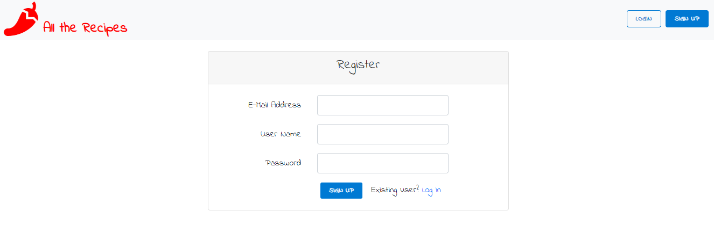
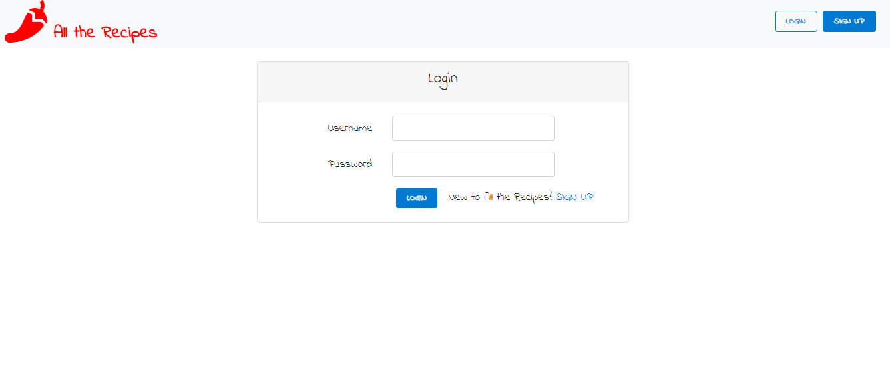
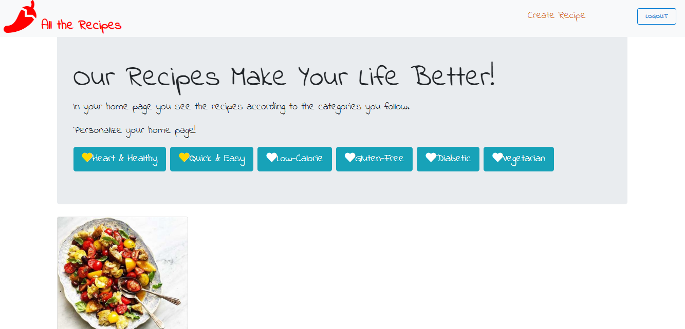
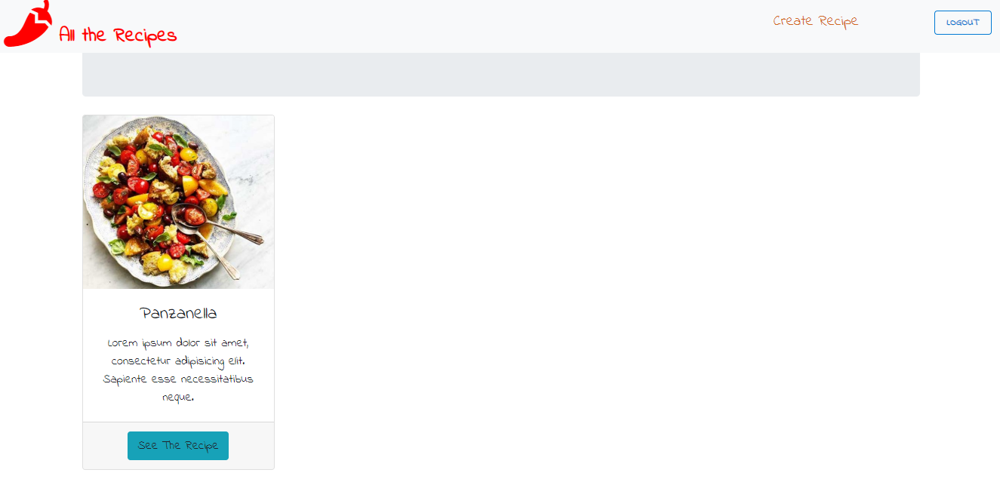
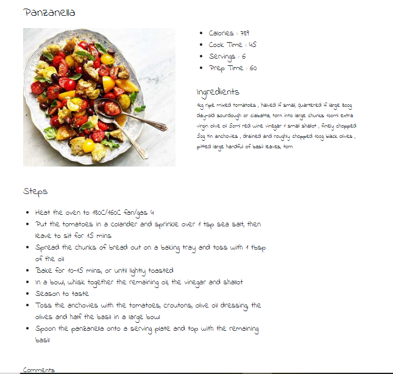
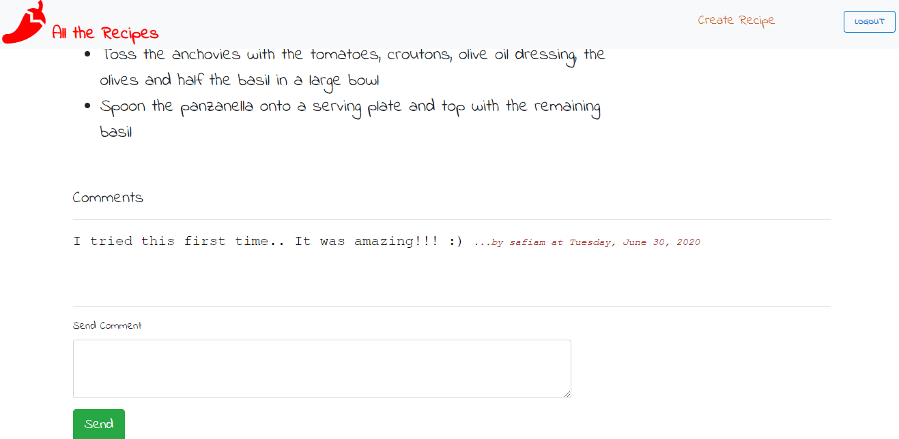
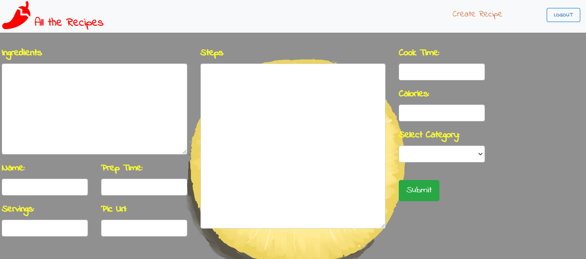

# MyRecipes

This project was generated with [Angular CLI](https://github.com/angular/angular-cli) version 9.1.4.

## Development server

Run `ng serve` for a dev server. Navigate to `http://localhost:4200/`. The app will automatically reload if you change any of the source files.

## Code scaffolding

Run `ng generate component component-name` to generate a new component. You can also use `ng generate directive|pipe|service|class|guard|interface|enum|module`.

## Build

Run `ng build` to build the project. The build artifacts will be stored in the `dist/` directory. Use the `--prod` flag for a production build.

## Running unit tests

Run `ng test` to execute the unit tests via [Karma](https://karma-runner.github.io).

## Website for recipes built using Angular, Bootstrap Framework, Font Awesome Icons. The backend is built using Spring Framework. You can find the backend source code here - https://github.com/safalam20/spring-recipes

# After user complete sign-up form, a verification email is sent to user's email. User needs to click to given link to enable account.
 

 

# Log-in page

 

# After successfull login, user is redirected to the personalized home page. Home page lists recipes according to followed categories. Newest recipes are shown first.
# User can follow or unfollow categories. Category changes will update the recipes that are shown in home page.

 

 

# View of recipe card

 

# User views recipes in a different page. Recipes contain comments written by other users. 

 

 

# Creating new recipe

